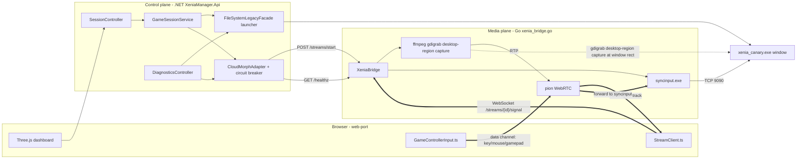

# Xenia CloudMorph Streaming Architecture

This document describes how DashX360 streams a running Xenia emulator window
into the browser (Three.js dashboard) with WebRTC video/audio and
keyboard/mouse/gamepad input forwarding.

## Two planes, one system

The system is split into a **control plane** and a **media plane**. They are
separate processes with a narrow HTTP contract between them, which keeps
session/auth concerns out of the low-latency media path.

## Control plane (.NET `XeniaManager.Api`)

Responsible for auth, session lifecycle/idempotency, and launching Xenia
itself. Never touches video/audio or raw input.

- `SessionController` (`POST /api/session/start`, `GET /api/session/{id}`,
  `POST /api/session/{id}/stop`) — the only entry point the frontend calls to
  start/inspect/stop a play session.
- `GameSessionService` — orchestrates: resolve/launch Xenia via
  `IGameLauncher`, call `ICloudMorphAdapter.StartStreamAsync`, persist session
  state via `INetBoxRepository`, publish lifecycle events
  (`SessionReused`, `SessionStaleRecovered`, `SessionStarted`, `SessionFailed`,
  `SessionStopped`) through `IBackendEventSink`, and log at every branch with a
  `logger.BeginScope` correlation ID (`session:{id}`).
- `FileSystemLegacyFacade` (`IGameLauncher`) — resolves the Xenia executable
  path, gates concurrent launch/stop with a `SemaphoreSlim`, and reuses an
  already-running process instead of double-launching (logged as "reusing
  existing process instead of launching a duplicate").
- `CloudMorphAdapter` (`ICloudMorphAdapter`) — the only .NET component that
  talks to the Go bridge. Wraps every call in a request timeout
  (`CloudMorph:RequestTimeoutSeconds`), a circuit breaker
  (`ICloudMorphCircuitBreaker`, opens after
  `CloudMorph:CircuitBreakerFailureThreshold` consecutive failures for
  `CloudMorph:CircuitBreakerOpenSeconds`), and a start-stream retry
  (`CloudMorph:StartStreamRetryCount`). Also resolves the bridge's relative
  `streamUrl` (e.g. `/streams/{id}/signal`) into an absolute `ws://`/`wss://`
  URL via `BuildAbsoluteSignalUrl`, using the configured worker/base URL's
  host+port — the browser cannot resolve a relative path itself.
- `DiagnosticsController` (`GET /api/diagnostics`) — aggregates launcher
  status, CloudMorph `/healthz` result, and circuit breaker state for a single
  no-auth troubleshooting call.

## Media plane (Go `xenia_bridge.go`, part of `cloud-morph-master`)

A single Go binary (`server.go` + `xenia_bridge.go`, package `main`) hosts the
media API. Unlike the original cloud-morph demo (which launched its own app
at boot and blocked the HTTP server on the first RTP packet), this bridge:

- Binds and starts serving immediately (no blocking app launch).
- Is gated behind `config.yaml`'s `enableLegacyDemoApp` (default `false`):
  when false, `NewXeniaBridge(cfg)` + `RegisterRoutes(r)` are used instead of
  the legacy `cloudapp.NewServerWithHTTPServerMux` path.
- Only manages capture/streaming for a Xenia process that the **.NET launcher
  already started** — it never starts Xenia itself.

Routes (`XeniaBridge.RegisterRoutes`):

| Method | Path | Purpose |
|---|---|---|
| GET | `/healthz` | `{status, captureReady, streamReady, activeSessions}` |
| GET | `/streams` | List known sessions (debug/diagnostics) |
| POST | `/streams/start` | Idempotent per `sessionId`; returns `{streamId, streamUrl, controllerStatus, status, ...}` |
| POST | `/streams/stop` | Accepts `{streamId}` or `{sessionId}`; idempotent even if unknown |
| GET | `/streams/{id}/status` | `{streamId, status, error}` |
| POST | `/streams/{id}/controller-profile` | Stub for future per-session input customization |
| GET/WS | `/streams/{id}/signal` | WebRTC signaling WebSocket |

### Capture pipeline (`runCapture`)

1. Open a local UDP listener on a per-session port (`5100`, `5101`, ...).
2. **Resolve the target window's exact title and screen rectangle** via
   `resolveWindowTarget()` (`user32.dll` `EnumWindows`/`GetWindowTextW`/
   `IsWindowVisible`/`GetWindowRect`, polling up to 5s). Title resolution is
   needed because emulator window titles embed build metadata that changes
   every build (e.g. `Xenia-canary (canary_experimental@<hash> on <date>)`),
   so the statically configured `windowTitle: Xenia` in `config.yaml` is only
   ever a substring to search for. The rectangle is needed for capture itself
   (see below).
3. Spawn `ffmpeg -f gdigrab -framerate 30 -offset_x <left> -offset_y <top>
   -video_size <w>x<h> -i desktop ... -f rtp rtp://127.0.0.1:<port>`, tracked
   as `xeniaSession.ffmpegCmd`. **Capture uses gdigrab's `desktop` mode at the
   window's screen coordinates, not gdigrab's per-window `title=` mode.**
   Per-window title capture does a `BitBlt` against the window's own device
   context, which reads back solid black for windows that render through a
   hardware-accelerated flip-model swap chain (Direct3D 11/12, Vulkan, modern
   OpenGL) — exactly how Xenia renders — because the window's private surface
   is bypassed under that presentation model. Capturing the desktop region
   instead reads the DWM-composited final screen image, which is unaffected
   by the window's own rendering/present model. If the window's rectangle
   can't be resolved (e.g. it closed between resolution and capture start),
   `runCapture` falls back to the old `title=` mode rather than failing
   outright, logging a warning that the fallback may render black.
4. Spawn `winvm/syncinput.exe "<resolved title>" . windows`, tracked as
   `xeniaSession.syncInputCmd`, so keyboard/mouse events sent over the data
   channel have somewhere to go. (`syncinput.cpp`'s `main()`: argv[1]=window
   title, argv[2]="game" sets a DirectX-specific flag we don't use (pass
   `"."`), argv[3] selects the `windows`/`host.docker.internal` code path;
   the binary always dials `127.0.0.1:9090`.) syncinput still needs the exact
   title string (it does its own `FindWindowEx`-based lookup internally) —
   only ffmpeg's input mode changed.
5. Wait up to `firstPacketTimeout` (10s) for the first RTP packet. On
   timeout, set status `capture-timeout` and call `stopSession()` — this is
   defense-in-depth so a bad window title or ffmpeg failure never hangs a
   session forever.
6. On success, set status `live` and forward subsequent RTP packets into the
   session's `pion` WebRTC video track (non-blocking, drops packets if no
   peer is connected yet).

### Input injection

- `syncInputBridge` — a TCP listener on `127.0.0.1:9090` (single connection,
  matching the hardcoded port in `syncinput.cpp`) implementing the same wire
  protocol as the original cloud-morph demo:
  `K<code>,<state>|` for keyboard, `M<isLeft>,<state>,<x>,<y>,<w>,<h>|` for
  mouse.
- `pumpInput` reads raw JSON `controlMessage`s off the WebRTC data channel
  (`{type: "key"|"mouseMove"|"mouseButton"|"gamepad", ...}`) and dispatches to
  `SendKey`/`SendMouseMove`/`SendMouseButton`.
- Gamepad buttons/left-stick are mapped to keyboard-equivalent key codes
  (`gamepadKeyMap`/`gamepadAxisKeyMap`) as a **best-effort bridge** — this is
  a known, documented limitation: there is no true XInput/analog controller
  injection without a virtual controller driver (e.g. ViGEmBus). The
  `inputInjector` interface is designed so a ViGEmBus-backed implementation
  could replace `syncInputBridge` later without touching session/WebRTC code.

### Signaling (`handleSignal`)

The server always creates the SDP offer (matching the original cloud-morph
wire protocol): on WebSocket upgrade, `crtc.NewWebRTC()` + `StartClient()`
produce an offer, sent immediately as `{type:"offer", data: base64(json(...))}`.
The client answers with `{type:"answer", data: ...}`; ICE candidates flow
both ways as `{type:"candidate", data: base64(json(candidate))}`. Once the
data channel opens, controller status flips from `connecting` to `game`.

## Frontend (`web-port/src`)

- `services/StreamClient.ts` — native `RTCPeerConnection`/`RTCDataChannel`
  client matching the exact signaling wire protocol above (base64-JSON
  envelopes for SDP/ICE, raw JSON for data-channel control messages).
- `engine/input-manager/GameControllerInput.ts` — captures
  keydown/keyup/mousemove/mousedown/mouseup and polls the Gamepad API via
  `requestAnimationFrame`, sending `controlMessage`s over the data channel
  only while the stream is live.
- `dashboard/menus/game-details-overlay.ts` — stream panel UI with explicit
  states (`idle`/`launching`/`connecting`/`live`/`unavailable`). Shows
  "unavailable" (not a spinner) if the resolved `streamUrl` doesn't look like
  a `ws://`/`wss://` URL, using `CloudMorphAdapter`/diagnostics health info to
  build a descriptive message.
- `dashboard/dashboard-app.ts` wires the "Activate" action: shows the
  launching state immediately (before the session API call resolves),
  connects the stream on success, and falls back to the "unavailable" state
  on any failure without leaving the UI in an indeterminate spinner state.

## Dev workflow (`web-port/scripts/dev.mjs`, `stop-dev-sessions.bat`)

One command (`npm run dev` from `web-port/`) builds and starts all three
processes:

1. `dotnet build --output .dev-build/api` (XeniaManager.Api)
2. `go build -o cloudmorph-dev.exe .` (whole package — **must** build the
   whole `main` package, not just `server.go`, since `xenia_bridge.go` lives
   in the same package and would otherwise be excluded, producing
   `undefined: XeniaBridge` build errors)
3. Start CloudMorph, poll `GET /healthz` until 200 (up to 180s)
4. Start the API on a dynamically found free port, poll until it's listening
5. Start Vite on port 3600 with `VITE_DEV_API_TARGET` pointing at the API

Both `dev.mjs` and `stop-dev-sessions.bat` kill any stale
`XeniaManager.Api.exe`/`cloudmorph-dev.exe`/`syncinput.exe` processes (and
gdigrab-tagged `ffmpeg.exe` processes, matched by command line) before
starting and on shutdown, since Windows does not automatically kill child
processes when a parent process dies (no job object) — without this,
per-session ffmpeg/syncinput children could otherwise orphan across restarts.

## Known limitations

- **No true analog/XInput gamepad injection.** Gamepad buttons and the left
  stick are bridged to keyboard-equivalent presses only. Full controller
  fidelity requires a virtual controller driver (ViGEmBus), which is out of
  scope for this change.
- **Single active syncinput.exe connection.** The wire protocol (unchanged
  from the original cloud-morph demo) hardcodes TCP port 9090 and only
  accepts one connection at a time, matching the assumption that only one
  Xenia session is ever live.
- **Window-title resolution depends on `user32.dll` enumeration succeeding
  within 5 seconds.** If Xenia is slow to create its window, or if multiple
  windows match the configured substring, the first match wins — this is
  acceptable for the single-emulator-instance use case this system targets.
